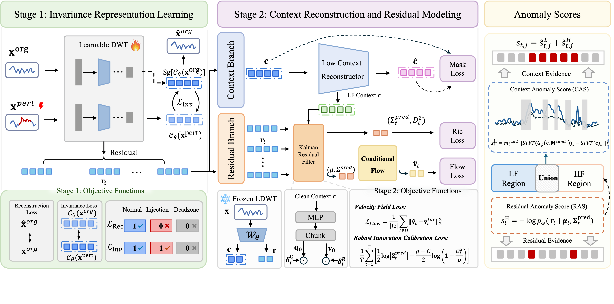

Residuals In Context: Dual-Criterion Modeling for Time-Series Anomaly Detection

**This code is the official PyTorch implementation of our paper: _Residuals In Context: Dual-Criterion Modeling for Time-Series Anomaly Detection_.**

[](#citation)
[](https://www.python.org/)
[](https://pytorch.org/)
[](LICENSE)

If you find this project helpful, please consider giving it a ⭐ Star to show your support. Thank you!

## Introduction

Time-series anomaly detection must identify observations that depart from normal temporal patterns while avoiding a common reconstruction shortcut: suspicious observations may participate in their own reconstruction and therefore be reconstructed deceptively well. Masking suspicious observations reduces this shortcut, but can also remove the local dynamic evidence needed to identify fine-grained anomalies.

We propose **RiCo**, a dual-criterion framework that combines contextual reconstruction with conditional residual likelihood evaluation. A learnable wavelet front end separates each time series into a low-frequency (LF) context and a time-aligned high-frequency (HF) residual. The **Context Anomaly Branch (CAB)** reconstructs masked candidate regions from the remaining LF context, while the **Residual Anomaly Branch (RAB)** evaluates the HF residual with a conditional flow informed by the predictive mean and covariance of a diagonal Kalman filter. RiCo then fuses the contextual and residual evidence into the final anomaly score.

<div align="center">
  
</div>

<p align="center"><em>Overall framework of RiCo. The learnable wavelet front end supplies LF context to CAB and HF residuals to RAB; their anomaly evidence is fused for final detection.</em></p>

The main components of **RiCo** are:

1. **Invariance Representation Learning** with a learnable wavelet front end.
2. **Candidate-Guided Contextual Reconstruction** for context anomaly scoring.
3. **Kalman-Informed Conditional Flow Matching** for residual likelihood scoring.
4. **Robust CAS-RAS Fusion** using channel-wise median/MAD normalization.

## Quickstart

> [!IMPORTANT]
> Python 3.9 or newer is required. A CUDA-enabled PyTorch installation is recommended for full benchmark experiments.

### 1. Requirements

Create a Python environment and install the dependencies:

```shell
python -m pip install -r requirements.txt
```

### 2. Data preparation

Download the TSB-AD datasets from the [TSB-AD repository](https://github.com/TheDatumOrg/TSB-AD), then place the CSV files in a local dataset directory.

The runner follows the original TSB-AD CSV convention:

- feature columns come first;
- the final column contains binary anomaly labels;
- each filename contains `_tr_<N>_`, where `N` is the training-prefix length.

### 3. Train and evaluate RiCo

Run RiCo on a dataset directory:

```shell
python main.py \
  --data /path/to/TSB-AD-U \
  --output-dir evaluation_results
```

Run it on one CSV file:

```shell
python main.py \
  --data /path/to/example_tr_500_1st_900.csv \
  --output-dir evaluation_results
```

Add `--cpu` to disable CUDA. Evaluation uses the original TSB-AD-compatible
`get_metrics` implementation and the same call used by the source project:
`version="opt"`, `thre=250`, and an automatically estimated VUS sliding window.
The six paper metrics are AUC-ROC, AUC-PR, VUS-ROC, VUS-PR, Point-F1
(`BestF1`), and Range-F1 (`RangeF1`).

Each run creates the following result files:

```text
evaluation_results/
├── Filewise_scores/
│   └── <series>_output.csv
├── Filewise_metrics/
│   └── <series>_metrics.csv
├── summary_metrics.csv
├── average_metrics.csv
├── categorical_metrics.csv
├── runtime_per_file.csv
├── runtime_by_category.csv
└── summary_metrics.json
```

The point-wise file contains the ground-truth labels, fused anomaly score,
decision threshold, predicted labels, CAS/RAS branch scores, weighted fusion
contributions, and the first active channel's Kalman residual statistics. The
metric files also retain PA-F1, event-based F1, and affiliation F1 returned by
the original evaluator.

To inspect the main detector implementation, see [`detectors/rico.py`](detectors/rico.py).

## Method

RiCo is trained in two stages.

### Stage 1: Invariance representation learning

A three-level learnable wavelet operator initialized with db2 filters decomposes the input into LF context and HF residual components. Full-band reconstruction prevents degenerate filters, while synthetic point, contextual, and seasonal perturbations supervise LF invariance.

### Stage 2: Context and residual modeling

The learned wavelet operator is frozen. CAB learns to reconstruct randomly masked LF blocks using a three-layer dilated temporal CNN. In parallel, a diagonal Kalman filter estimates residual predictive statistics and is calibrated with a Student-t Robust Innovation Calibration loss. A conditional flow-matching model uses the Kalman predictive mean and covariance to estimate residual likelihood.

### Anomaly scoring

Smoothed LF deviation and RAS independently select their top 50% temporal positions. Each candidate region is expanded by four samples, and their union is masked for contextual reconstruction. CAS is calculated from the masked STFT discrepancy, while RAS is the conditional residual negative log-likelihood. Both branches are normalized per channel with median/MAD scaling, restricted to positive deviations, and added. Scores from overlapping windows are averaged at their absolute timestamps.

The implementation uses the paper defaults: window length 100, db2 initialization, three wavelet levels, context width 32, dilations 1/2/4, batch size 128, Adam learning rate 5e-3, at most 10 epochs per stage, early-stopping patience 3, flow-loss weight 200, Student-t degrees of freedom 4, gradient clipping norm 5, candidate ratio 0.5, smoothing width 5, padding 4, and four Euler integration steps.

## Results

Experiments on TSB-AD-U and TSB-AD-M show that RiCo achieves the best AUC-PR and Point-F1 on both benchmarks and ranks first or second across all six reported evaluation metrics.

Compared with the evaluated diffusion-based baselines that require iterative multi-step denoising, RiCo achieves **2.5×-13.2×** and **3.0×-7.7×** total-run-time speedups on TSB-AD-U and TSB-AD-M, respectively.

## Project structure

```text
RiCo/
├── detectors/
│   └── rico.py
├── utils/
│   ├── basic_metrics.py
│   ├── kalman/
│   ├── ADWT_1D.py
│   ├── anomaly_injector.py
│   ├── dataset.py
│   ├── debounce_mask.py
│   ├── metrics.py
│   ├── sliding_window.py
│   └── torch_utility.py
├── affiliation/
├── framework.png
├── main.py
├── README.md
└── requirements.txt
```

## Citation

If you find this repository useful, please cite our paper:

```bibtex
@article{tang2026rico,
  title   = {Residuals In Context: Dual-Criterion Modeling for Time-Series Anomaly Detection},
  author  = {Tang, Shengnan and Chai, Li and Wang, Xingjian and He, Shibo and Yang, Chunjie},
  year    = {2026}
}
```

## Contact

If you have any questions or suggestions, please contact:

- **Shengnan Tang** ([tsn@zju.edu.cn](mailto:tsn@zju.edu.cn))

You can also describe the problem in an Issue.
